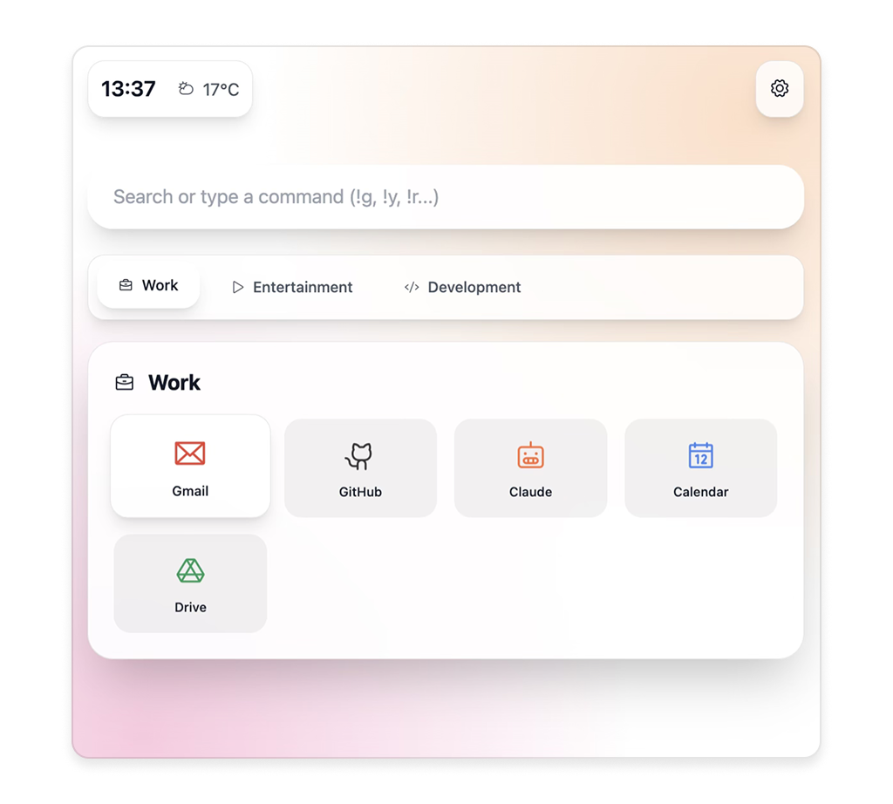

# 🖤 ultrapage

a beautiful, customizable browser startpage with vim-like navigation and modern design.

## features

- **clean minimal design** with animated gradients and glassmorphism effects
- **vim-style keyboard navigation** for power users
- **customizable sections** with drag-and-drop organization
- **smart search** with bang commands for quick access to different search engines
- **real-time weather** display based on your location
- **responsive design** that works perfectly on desktop and mobile
- **dark/light mode** support with automatic system preference detection
- **local storage** for all your customizations

## demo

visit [ultrapage.ru](https://ultrapage.ru) to see it in action.

## keyboard shortcuts

| key | action |
|-----|--------|
| `/` | focus search bar |
| `j/k` | navigate between tabs |
| `1-9` | switch to tab by number |
| `?` | toggle help |
| `esc` | clear search/hide help |

## search commands

ultrapage supports bang commands for quick searches:

- `!g` - google
- `!y` - youtube  
- `!r` - reddit
- `!x` - x (twitter)
- `!cl` - claude ai
- `!ch` - chatgpt
- `!gh` - github
- `!so` - stack overflow
- `!w` - wikipedia
- `!d` - duckduckgo

## installation

1. clone the repository:
```bash
git clone https://github.com/ehlvg/ultrapage.git
cd ultrapage
```

2. open `index.html` in your browser or serve it with a local server:
```bash
# using python
python -m http.server 8000

# using node.js
npx serve .
```

3. set as your browser's homepage or new tab page.

## customization

### adding sections

1. click the settings button (gear icon) in the top right
2. click "add section" 
3. configure your section with:
   - name and icon (using [phosphor icons](https://phosphoricons.com/))
   - custom items with urls, icons, and colors

### changing background

choose from 4 beautiful gradient backgrounds in the settings panel.

### modifying default configuration

edit the `defaultConfig` object in `script.js` to change:
- default location for weather
- initial sections and bookmarks
- search engine shortcuts

## technical details

ultrapage is built with:
- **vanilla javascript** - no framework dependencies
- **tailwind css** - for rapid styling and responsiveness
- **phosphor icons** - beautiful icon library
- **open-meteo api** - for weather data
- **local storage** - for persistent configuration

## file structure

```
ultrapage/
├── index.html          # main html file
├── script.js           # all javascript functionality
├── styles.css          # custom css and gradients
├── tailwind.config.js  # tailwind configuration
└── cname              # domain configuration
```

## browser support

ultrapage works on all modern browsers that support:
- css grid and flexbox
- es6+ javascript features
- local storage api
- fetch api

## contributing

contributions are welcome! please feel free to submit issues and pull requests.

## license

mit license - feel free to use this project for personal or commercial purposes.

---

made with ❤️ for a better browsing experience.
